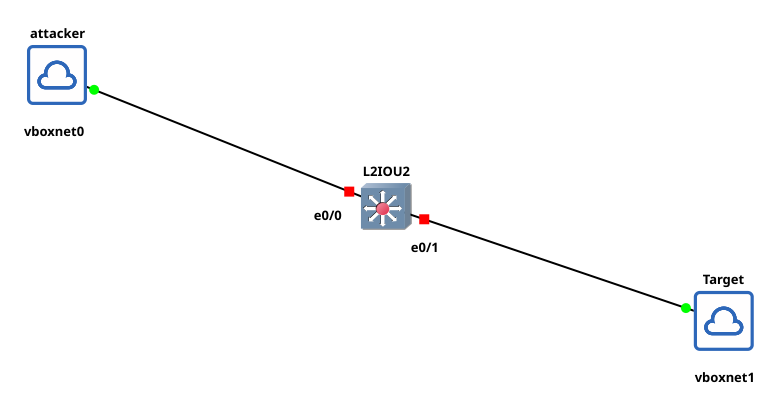

# NDP spoof

[](https://www.gnu.org/licenses/gpl-3.0)
[](https://pkg.go.dev/github.com/shadowy-pycoder/ndpspoof)

[](https://goreportcard.com/report/github.com/shadowy-pycoder/ndpspoof)


## Install

1. Arch Linux/CachyOS/EndeavourOS

```shell
yay -S nf
```

2. Other systems

```shell
CGO_ENABLED=0 go install -ldflags "-s -w" -trimpath github.com/shadowy-pycoder/ndpspoof/cmd/nf@latest
```

## Usage

```shell
Usage of nf:
  -I    Display list of interfaces and exit.
  -auto
        Automatically set kernel parameters and network settings for spoofing
  -d    Enable debug logging
  -dns-servers string
        Comma separated list of DNS servers for RDNSS mode. Example: "2001:4860:4860::8888,2606:4700:4700::1111"
  -f    Run NA spoofing in fullduplex mode
  -g string
        IPv6 address of custom gateway (Default: default gateway)
  -i string
        The name of the network interface. Example: eth0 (Default: default interface)
  -interval duration
        Interval between sent packets (default 5s)
  -na
        Enable NA (neighbor advertisement) spoofing
  -nocolor
        Disable colored output
  -p string
        IPv6 prefix for RA spoofing
  -ra
        Enable RA (router advertisement) spoofing. It is enabled when no spoof mode specified
  -rdnss
        Enable RDNSS spoofing. Enabling this option requires -dns-servers flag
  -rlt duration
        Router lifetime for RA spoofing (default 10m0s)
  -t string
        Targets for NA spoofing. Example: "fe80::3a1c:7bff:fe22:91a4,fe80::b6d2:4cff:fe9a:5f10"
  -v    Show version and build information
```

### Example lab to test this tool



1. Kali machine with Host-only network vboxnet0
2. Mint machine with Host-only network vboxnet1
3. Cisco IOS on Linux (IOL) Layer 2 Advanced Enterprise K9, Version 17.16.01a (x86_64)

On Kali machine run:

```shell
nf -d -auto -ra -i eth0 -p 2001:db8:7a31:4400::/64
```

On Mint machine run:

```shell
ip -6 route
```

You should see Kali machine link local IP as a default gateway

### Usage as a library

See [https://github.com/shadowy-pycoder/go-http-proxy-to-socks](https://github.com/shadowy-pycoder/go-http-proxy-to-socks)
